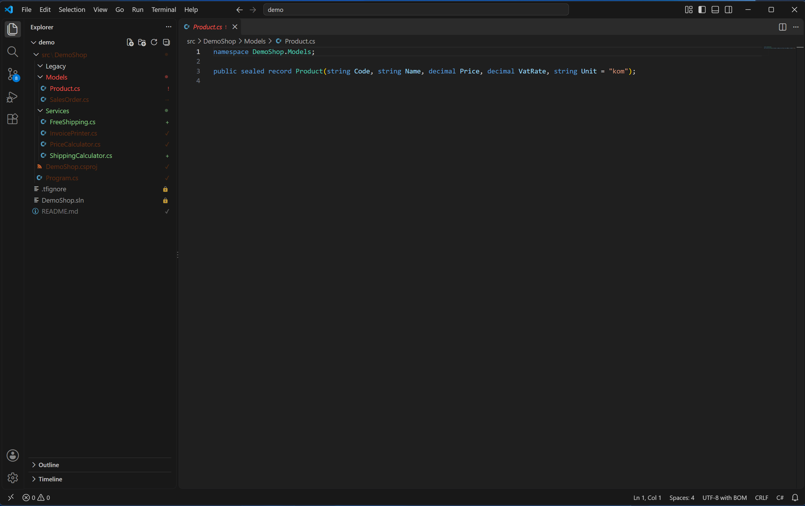
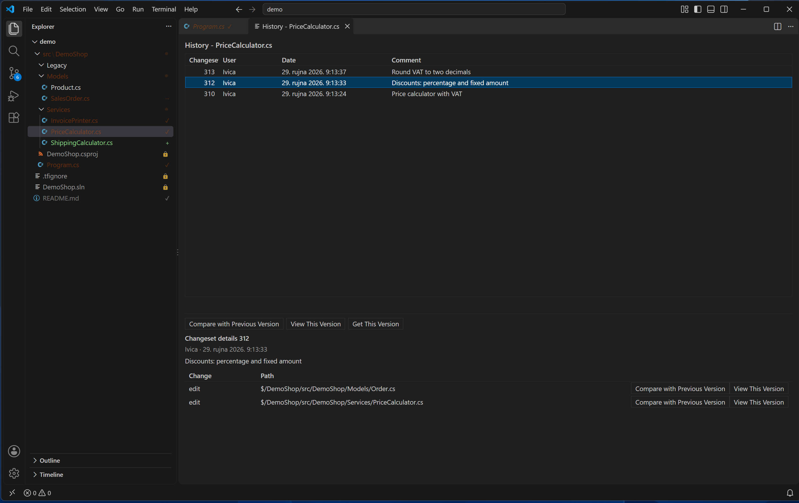
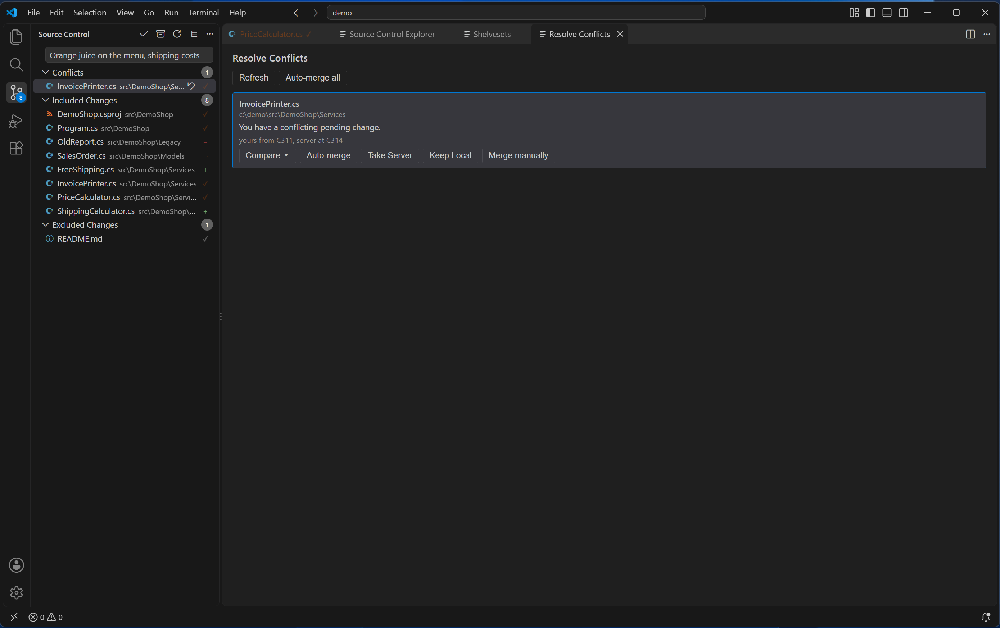

# Team Explorer (TFVC)

Not affiliated with or endorsed by Microsoft.

Team Explorer-style TFVC support for VS Code: a Source Control panel for pending changes, editor
badges and menus, history and annotate, a Source Control Explorer, workspace management,
shelvesets and conflict resolution. Runs on Windows and on Linux under Wine.

## Pending changes

The Source Control panel lists your pending changes as **Included Changes** and **Excluded
Changes**, with **Conflicts** shown separately when you have any. Type a comment and press
**Check In** — it always asks you to confirm first, and it is the only way to check in. Each row
can be excluded or undone; a checked-out row can also be compared with the server version, and a
checked-out or pending-delete row opened in History.

See [Pending changes](manual/pending-changes.md).

## Editing files

Files under source control get a badge in the Explorer: a lock, a check mark once checked out, a
plus for a pending add, a minus for a pending delete, an arrow for a pending rename, and a red
warning if a file was edited without being checked out. With `teamExplorer.autoCheckout` set to
`onEdit` (the default), a file is checked out the moment you start typing, the way Visual Studio
does. The editor's context menu adds Check Out for Edit, Compare with Latest Version, View History
and more; the Explorer's **Team Explorer** submenu adds those plus Undo Pending Changes, Get
Latest Version and Add to Source Control.

See [Editing files](manual/editing-files.md).

## History and annotate

**View History** opens a changeset grid for a file or folder. Selecting a changeset in a file's
History offers **Compare with Previous Version**, **View This Version** and **Get This Version**;
a folder's History shows changeset details only. **Load more** fetches older changesets.
**Annotate** shows who last changed each line in the editor's margin —
`local` for an uncommitted line, otherwise the changeset — with the user, date and comment on
hover.

See [History and annotate](manual/history-annotate.md).

## Source Control Explorer

Browse the whole server tree, not just what is mapped locally, from `$/` down to any folder. The
list shows each item's pending change, who has it pending, when it was last checked in, and
whether your copy is the latest version. **Get Latest Version**, **Get Specific Version…** (by
changeset, date or label), **Map to Local Folder…**, **Rename…** and **Delete** all work directly
from here.

See [Source Control Explorer](manual/source-control-explorer.md).

## Workspaces

**Manage Workspace** creates a server workspace and maps or unmaps server folders to local
folders. Visual Studio shares the same workspace, so a mapping made here shows up there too — and
moving a mapping moves the files themselves on the next Get.

See [Workspaces](manual/workspaces.md).

## Shelvesets

**Shelve…** saves your included changes to the server under a name, and can undo them locally at
the same time. **Find Shelvesets** lists shelvesets by owner; picking one shows a details pane with
**Compare with Unmodified**, **Compare with Workspace Version** and **Unshelve** — unshelving only
some of a shelveset's changes asks first, since the rest would otherwise be lost when the
shelveset is deleted. **Delete Shelveset…** removes one for good.

See [Shelvesets](manual/shelvesets.md).

## Conflicts

When a Get or an Unshelve leaves a file in conflict, it appears in a **Conflicts** group and in the
**Resolve Conflicts** tab, with **Auto-merge**, **Take Server**, **Keep Local** and **Merge
manually** for each one, plus a **Compare** menu for Local, Server and Base.

See [Conflicts](manual/conflicts.md).

## Settings

Every setting lives under `teamExplorer.*`: the collection URL, the wrapper path, auto-checkout
mode, the command timeout, whether Explorer badges are shown, the ignore list for check-in, the
background scan for files not in source control, and whether to show those files or the activity
bar icon. The six `teamExplorer.*Foreground` color ids can be themed like any other VS Code color.

See [Settings](manual/settings.md).

## Install

See the [install guide](install/README.md) to get started.
