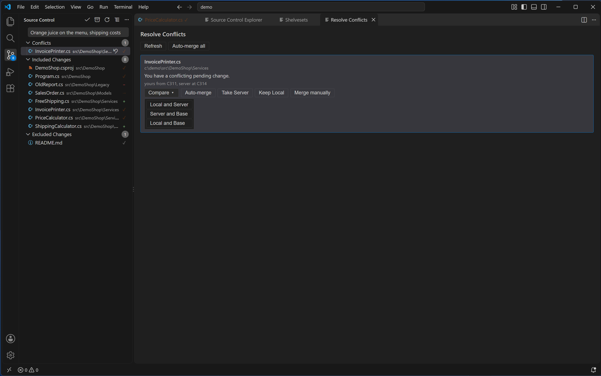

# Resolving conflicts

[Back to the manual](README.md)

A conflict is TFVC's way of saying a Get or an Unshelve could not simply apply cleanly: usually the
server has moved on since your local copy or your pending change was based on it. Team Explorer
looks for conflicts after a Get Latest Version or Get Specific Version from the [Source Control
Explorer](source-control-explorer.md), after a Get from [Manage Workspace](workspaces.md), and after
every Unshelve. When it finds any, it opens the Resolve Conflicts tab on its own. (History's own Get
This Version does not trigger this check.)

## The Conflicts group

Conflicted files also show up as a **Conflicts** group in the Source Control panel, above Included
Changes — it stays hidden whenever there is nothing in it. Each row is a file, with `tf`'s own
explanation of the conflict as its tooltip; clicking a row opens Resolve Conflicts on that file. You
can also open it directly with **Team Explorer: Resolve Conflicts**, or **Resolve Conflicts** in the
Source Control panel's "…" menu.

## The Resolve Conflicts tab

The tab is titled "Resolve Conflicts", with **Refresh** and **Auto-merge all** across the top.
**Auto-merge all** tries every conflict it can merge automatically at once and reports how many it
resolved ("Auto-merge resolved `<n>` of `<m>` conflict(s)." or "Auto-merge resolved nothing." when
none qualify).

Each conflict is its own card: the file's name and folder, `tf`'s reason for the conflict (shown
exactly as `tf` gives it), and, where known, the versions involved ("yours from C`<n>`, server at
C`<n>`"). Below that sit the buttons that apply to this particular conflict:

- **Compare** (a drop-down) — **Local and Server** (the default), **Server and Base**, **Local and
  Base**. A binary file still opens here: its server side is downloaded to a temporary file and VS
  Code decides how to show it, the same way Visual Studio's own diff does, so Compare is never
  refused just because `tf` calls the file binary.
- **Auto-merge** — resolves this one conflict automatically where it can. For an ordinary conflict
  on a binary file this button is withheld, because `tf` cannot text-merge binaries; every other
  button below still applies to a binary conflict.
- **Take Server** — "Take the server's version of `<name>`?", detail "Your pending change to it is
  undone, and your edits to the file are lost."
- **Keep Local** — "Keep your version of `<name>`?", detail "It stays exactly as it is, and your
  next Check In replaces what others checked in up to C`<n>` — their changes are not merged." (the
  "up to C`<n>`" part is left out when the server's changeset is not known.)
- **Merge manually** — opens Local and Server so you can edit the file until it holds both sides,
  then offers **Resolved** ("Mark `<name>` as merged?", detail "Your next Check In sends the file
  exactly as it is now.") and **Cancel** to step back out of merging. Unsaved edits are saved first.
- **Overwrite local file** — offered only when a local file is in the way with nothing pending on
  it; "Replace `<name>` with the server's version?", detail "The file on disk is not in source
  control, and it will be lost."

A conflict of a kind this extension does not specifically recognise still offers Auto-merge, Take
Server, Keep Local and Overwrite local file, with `tf`'s own reason shown and a general warning in
place of the usual detail, since exactly what would be lost is not known for that kind.

