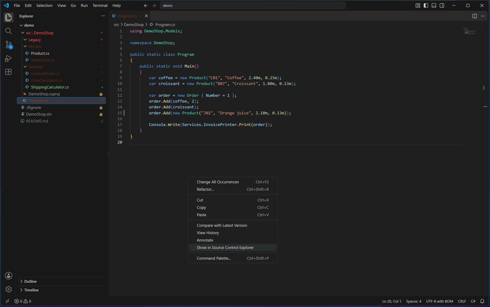
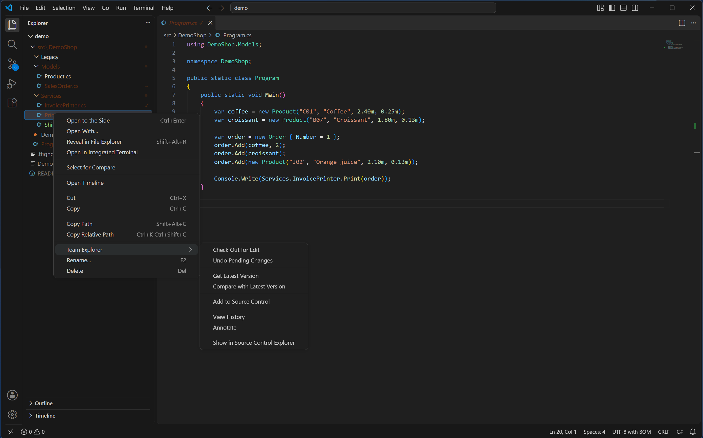

# Editing files

This page covers everything outside the Source Control panel: the badges in the Explorer, checking
files out as you type, the right-click menus, and what happens when you rename, move or delete a
file the VS Code way.

## Explorer badges

With `teamExplorer.decorations` on (the default), every file under a TFVC mapping gets a small
badge in the Explorer:

| Badge | Meaning | Colour |
|---|---|---|
| 🔒 | Under source control, no pending change | `teamExplorer.versionedForeground` |
| ✓ | Checked out for edit | `teamExplorer.checkedOutForeground` |
| + | Added, not checked in yet | `teamExplorer.addedForeground` |
| − | Pending delete | `teamExplorer.deletedForeground` |
| → | Pending rename | `teamExplorer.checkedOutForeground` |
| ! | Edited without being checked out — TFVC cannot see this change | `teamExplorer.hazardForeground` |

The `!` badge is worth pausing on: it means the file was made writable and edited some other way
than through this extension (for example, its read-only bit was cleared by hand, or by another
program). TFVC does not know about that edit at all, and it is not included when you check in
until you check the file out properly. See [Settings](settings.md) for how to change any of the
six colours.

**No badge** is also meaningful — it means one of: the file genuinely is not in source control, it
matches an ignore pattern, it is outside any TFVC mapping, or (for a folder) nothing under it is
pending. The [Not in source control](pending-changes.md#the-groups) group in the Source Control
panel is what tells these apart.

**Excluded files** keep the same badge letter, only dimmed
(`teamExplorer.excludedForeground`), and their tooltip gains "(excluded from check-in)" — the
file's state has not changed, only its fate at the next check-in has.

**Folders** pick up the colour of whatever is pending inside them, but their own badge becomes a
small grey dot rather than the actual letter — this is VS Code's own behaviour for "contains
emphasized items", not something this extension controls. In the screenshot above, `Models` shows
that dot in red (matching `Product.cs`'s `!` badge) and `Services` shows it in green (matching the
files added inside it). `Legacy`, just above them, shows no dot at all, even though it holds a
pending change too: its one file is a pending *delete*, and a pending delete removes the file from
disk — so there is no row left in the tree for the folder to inherit a colour from. The lock badge
is the one exception to the bubbling itself: it never propagates, so a folder that is simply, fully
checked in and unmodified stays undecorated regardless of what is inside it.

## Auto-checkout

By default, editing a read-only tracked file checks it out for you automatically, the moment you
start typing — the same as Visual Studio. This is controlled by `teamExplorer.autoCheckout`:

- **`onEdit`** (default) — checks the file out on the first keystroke.
- **`onSave`** — waits and checks the file out just before you save, instead.
- **`disabled`** — never checks out automatically; use **Check Out for Edit** yourself first.

Under `onSave`, if the checkout takes too long, VS Code saves the file anyway before the checkout
finishes. If that save then fails with a read-only error, **do not** choose **Overwrite** — see
below.

## The editor menu

Right-click inside an open file for TFVC actions relevant to that specific file. What is offered
depends on the file's current state:

- **Check Out for Edit** — shown unless the file is already checked out, or is a pending add or
  pending delete. It IS shown for a pending rename: a rename alone does not check the file out for
  editing, and (unlike other pending changes) a renamed file's state stays "pending rename" even
  after you do check it out and edit it too, so this entry can stay visible throughout.
- **Compare with Latest Version** — shown once the file is checked out.
- **Check for Server Changes** — the same command as Compare with Latest Version, retitled: shown
  on a file with no pending change of its own. Not shown once the file is checked out, or for a
  pending add, delete or rename.
- **View History**, **Annotate** (swapping to **Hide Annotations** once the file is annotated) and
  **Show in Source Control Explorer** — shown for a file that is checked out, unmodified, or
  writable without being checked out. Not shown for a pending add or delete, or for a pending
  rename — tf cannot show a file's history, or annotate it, under a name it has not been checked in
  under yet.

## The Explorer's Team Explorer submenu

Right-click a file or folder in the Explorer (not the editor) for a **Team Explorer** submenu:

- **Check Out for Edit**
- **Undo Pending Changes**
- **Get Latest Version**
- **Compare with Latest Version** (files only)
- **Add to Source Control**
- **View History**
- **Annotate** (files only)
- **Show in Source Control Explorer**

Three of these act recursively when you run them on a folder: **Check Out for Edit** and **Undo
Pending Changes** apply to everything already pending underneath it, and **Get Latest Version**
always fetches recursively, whatever you select. If a Get Latest Version leaves anything in
conflict, those files appear in the Conflicts group of the Source Control panel, and the Resolve
Conflicts tab opens on its own; see [conflicts.md](conflicts.md).

**Adding a folder** always asks first:

> **Add this folder and everything in it?**
>
> Every file underneath, including subfolders, will be pended as an Add. Files already under
> source control are skipped, and so are build output and temporary files: tf ignores `*.exe`,
> `*.dll`, `*.pdb`, `bin`, `obj`, `Debug`, `Release` and 15 other patterns, the same way a folder
> add behaves in Visual Studio.
>
> It does NOT ignore `node_modules` or `packages`. Check the panel before you check in.
>
> [Add Recursively] [Cancel]

That warning means exactly what it says: `teamExplorer.ignore` (see [settings.md](settings.md))
does **not** apply here — that setting only feeds the background scan and the Explorer badges. A
folder Add runs `tf` with no exclusion list of its own, so what gets skipped is purely `tf`'s own
built-in patterns above, plus anything a `.tfignore` file excludes. A `node_modules` or `packages`
folder underneath the one you add **will** be pended, in full, unless a `.tfignore` says otherwise.
To add a single file the built-in exclusions would otherwise skip, right-click that file itself
rather than its folder.

## Rename, move and delete

Renaming, moving or deleting a tracked file **from inside VS Code's own Explorer** — F2,
drag-and-drop, the Delete key, or a refactor that renames a file — becomes a pending change
automatically, the same way it would in Visual Studio's Solution Explorer.

Two related things to know:

- A rename, move or delete made **outside** VS Code (a build script, a terminal `mv` or `del`,
  another editor) is not seen at all, and does not become a pending change. Recovering is not as
  simple as running **Add to Source Control** afterwards — that would pend the new name as a
  brand-new, unrelated file, and leave the old server item exactly as it was, now missing its local
  copy. Instead, move the file back to its old name and location on disk, then redo the rename or
  delete from inside VS Code's Explorer — or use the Source Control Explorer's own **Rename…**
  and **Delete**, which talk to `tf` directly and do not need the file moved back first; see
  [source-control-explorer.md](source-control-explorer.md).
- Moving a file to a destination **outside the current TFVC mapping** — even from inside VS Code —
  is not recorded as a rename either: TFVC has nowhere on the server to put it. Move it back, then
  decide deliberately whether to delete it or add it at the new location.

## Encoding protection

Some TFVC collections mix files in different code pages (for example Windows-1250 alongside
UTF-8). Two things guard against VS Code silently corrupting such a file:

- If VS Code has already mis-decoded a file you have open — some characters show as the �
  replacement character — auto-checkout refuses to check it out, and warns you instead of clearing
  the read-only bit on a file it would then let you save with data already lost. Close the file
  without saving, set `files.encoding` correctly for it, and reopen it.
- When you open a file whose bytes VS Code did not decode correctly, but TFVC's own record of its
  code page says how to read it, this extension reopens it with the right encoding automatically —
  you do not need to guess or set `files.encoding` yourself for that file.

## VS Code's "Overwrite" prompt

If saving a file fails because it is still read-only, VS Code offers an **Overwrite** action. **Do
not use it on a TFVC file.** Overwrite clears the read-only bit itself and writes the file straight
to disk, bypassing checkout entirely — the edit becomes invisible to TFVC, exactly the situation
the `!` badge above warns about. If a save fails this way, wait a moment for the checkout to finish
and save again, or run **Check Out for Edit** yourself first.

Back to the [manual contents](README.md).
