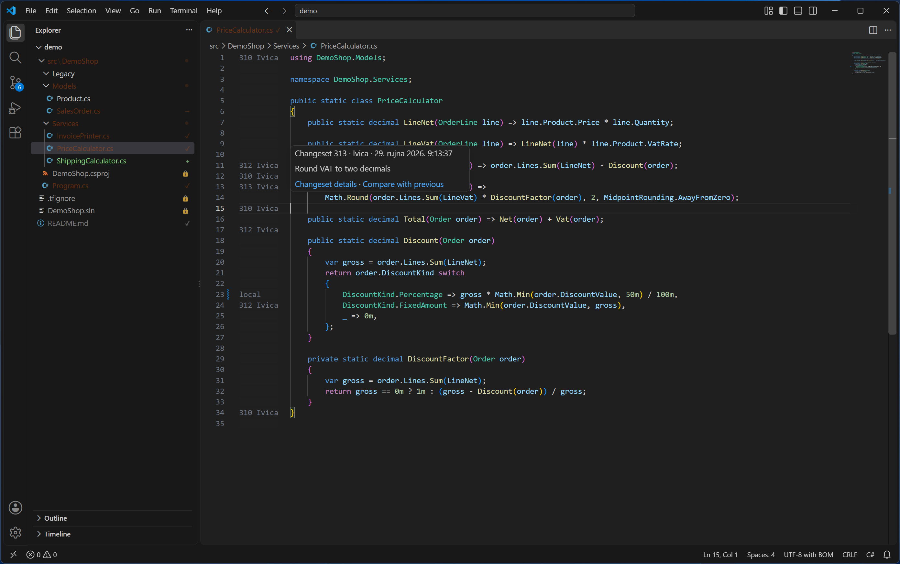

# History and Annotate

[Back to the manual](README.md)

## History

Right-click a file or a folder — in the Explorer (inside its own **Team Explorer** submenu), in the
Source Control panel, in the Source Control Explorer, or directly in the editor's own right-click
menu — and choose **View History**. History opens in its own tab, titled "History - `<name>`".
There is one tab per file or folder: asking for History again on something already open reveals its
existing tab instead of opening a second one.

### The grid

The grid has four columns: **Changeset**, **User**, **Date**, **Comment**, ordered by changeset
number. Dates are never parsed — they are shown exactly as `tf` printed them, in whatever language
and format `tf` itself used, a Croatian Windows showing Croatian month names for example. Reading a
changeset back out of `tf`'s output at all also depends on its field labels ("Changeset:", "User:",
"Date:", "Comment:", "Items:") staying in English; that held on every machine this was tested on
(English and Croatian output alike). A record whose labels do not match is quietly left out of the
grid; Annotate, which needs the complete history to walk, fails outright instead of risking a
misattributed line.

Older changesets are not all loaded at once. A **Load more** row at the bottom fetches the next
page; once every changeset is loaded, it disappears.

### Selecting a row

Selecting a row loads its changeset details underneath the grid: the user, the date, the full
comment, and (opening a *file's* History) a **Change** / **Path** table listing every item the
changeset touched. For a file's History, three buttons sit above the details, acting on the row you
selected:

- **Compare with Previous Version**
- **View This Version**
- **Get This Version**

On a folder's History, neither these three buttons nor a row's right-click menu appear at all —
selecting a row there shows only its changeset details ("A folder's history shows changeset details
only. Open a file's History to compare, view or get a version."). Opening History from a specific
file always gives you these three working on that file.

The details table also has its own **Compare with Previous Version** and **View This Version**
buttons, one pair per row, which act on that individual item within the changeset (useful when a
changeset touched several files).

A few situations refuse **Compare with Previous Version**, with a message explaining why: the
changeset is where the file began, so there is no previous version to diff against; the previous
page has not loaded yet (Load more first); the item was deleted in this changeset; or, for a renamed
item's own row in the details table, its previous version is under a different name — open that
file's own History instead, which follows renames. **Get This Version** does not share this
restriction: it works on a file's very first changeset just as well as any other.

**Get This Version** replaces your local copy of the file with an older changeset. It refuses when
the file has pending changes (undo or check them in first), is writable but not checked out (its
edits are invisible to this extension, so overwriting it would risk losing them), is missing from
disk, sits outside the folder currently open in VS Code, or was renamed since (Get This Version only
works on a version that is still under the file's *current* name). When none of that applies, it
asks to confirm — "Replace your copy of `<name>` with changeset `<n>`?", with the button **Get This
Version** — and reminds you that your workspace then holds that older version until you run Get
Latest Version again; nothing is checked in by doing this.

## Annotate

Annotate works on one file at a time: directly from the editor's own right-click menu, from a
file's entry in the Explorer's **Team Explorer** submenu, or with the command **Team Explorer:
Annotate**. It adds a margin to the left of the code, one entry per line, naming who last touched
that line and in which changeset.

The margin shows a label only on the first line of a run of unchanged lines; the rest of the block
reads blank, the way a blame margin normally does. A label is one of:

- `<changeset> <user>` — the changeset that last changed this line, and (truncated) the user who
  made it.
- `…` — the history walk has not reached this line's owning changeset yet; it fills in as the walk
  goes on.
- `local` — this line's current content differs from the version Annotate is comparing against.
  This does not require an unsaved edit: a checked-out file you already saved, but have not checked
  in, reads `local` too, on every line your edit touched.
- `≤ C<n>` — the walk stopped before reaching this line's real origin (a changeset that changed too
  much of the file to diff quickly, a cancellation, or a failed fetch partway through); it is
  somewhere at or before changeset `<n>`.

Hovering a line shows a heading — "Changeset `<id>` · `<user>` · `<date>`" — the full check-in
comment, and two links: **Changeset details** (opens History on this file, at that changeset) and
**Compare with previous** (only shown when both the line's own version and the version before it
are known).

If the file changes on disk outside VS Code (a Get, an Undo, or another program), Annotate does not
try to guess what changed: it tells you the file changed and asks you to run Annotate again.

To remove the margin, use **Hide Annotations**. In the editor's right-click menu and the Command
Palette it replaces **Annotate** once the file is annotated; the Explorer's own **Team Explorer**
submenu has no **Hide Annotations** entry, so use one of those two instead when annotating from
there.

