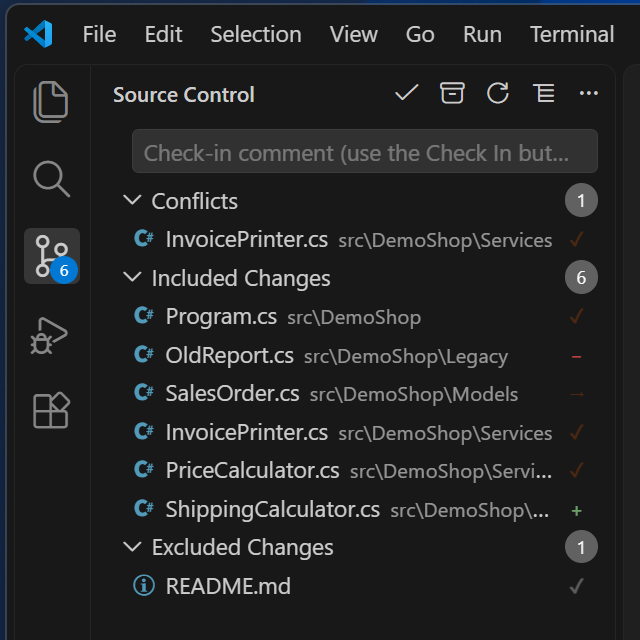
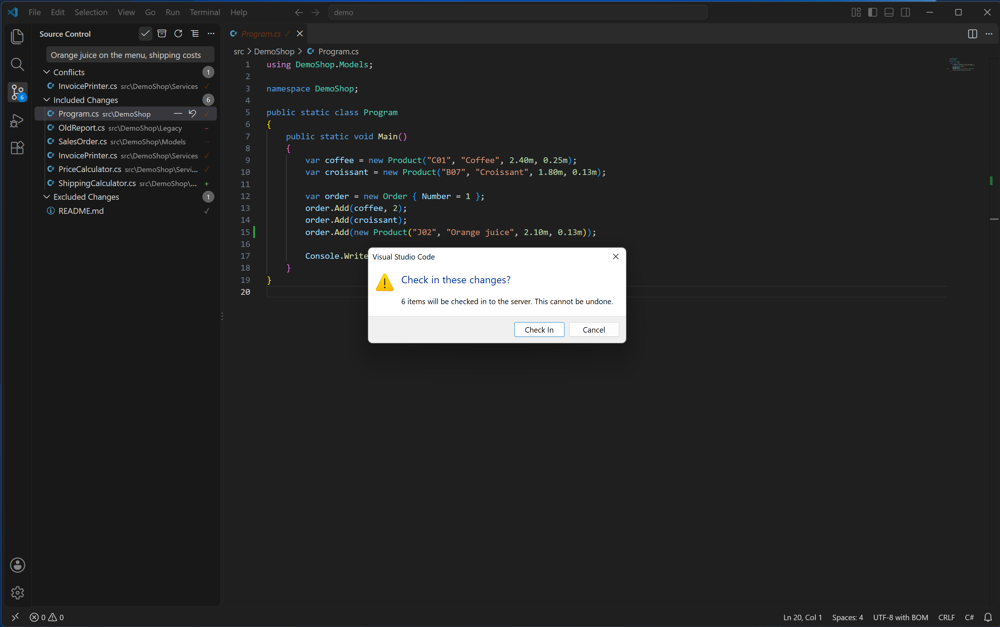
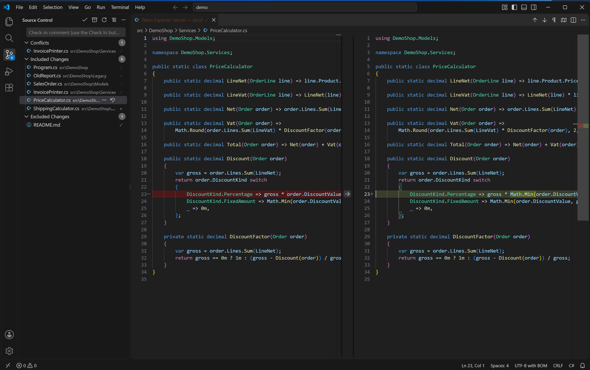

# Pending changes

Team Explorer (TFVC) adds a **Team Explorer** provider to VS Code's built-in Source Control view
(the same view git and other source-control extensions use). Open it from the Source Control icon
in the Activity Bar, or with **View: Show Source Control**.

If you have never used this extension before, read [Concepts](README.md#concepts) first — in
particular, that files are read-only until checked out, and that pending changes live on the
server.

## The groups

- **Conflicts** — files a Get or an Unshelve left in conflict. Hidden when there are none. Click a
  row to open Resolve Conflicts; see [conflicts.md](conflicts.md).
- **Included Changes** — your pending changes that will be checked in.
- **Excluded Changes** — pending changes you have deliberately held back from the next check-in.
  Hidden when there are none. This list is kept by this extension, locally; see
  [Concepts](README.md#what-is-shared-with-visual-studio-and-what-is-not).
- **Not in source control** — files under the open folder that TFVC does not know about. This
  group is **off by default**, to match Visual Studio's own Pending Changes, which does not list
  such files either. Turn it on with `teamExplorer.showNotInSourceControl` (see
  [settings.md](settings.md)). It is found by a background scan that runs either way — turning the
  group off only hides the list, not the scan; the scan is also what draws the red `!` warning
  badge described in [editing-files.md](editing-files.md).

If a group ever holds more than 500 files, the panel shows only the first 500 and the group's
title says how many there really are (for example "Included Changes (showing 500 of 812)"). The
hidden ones are not left out of anything else — Check In still takes every included change, not
just the visible ones.

## The comment box and Check In

Type a check-in comment in the box at the top of the panel (its placeholder reads
"Check-in comment (use the Check In button above)"). Then press the **Check In** button — the
checkmark icon in the panel's title bar.

**Check In is the only way to check in.** There is no keybinding for it and no Command Palette
entry — by design, so nothing can check code in by accident. This also means the box's own
Ctrl+Enter shortcut, which some source-control panels use to accept the input, does nothing here.

If Included Changes is empty, pressing Check In does nothing at all — not even a dialog. Otherwise
it always asks first:

> **Check in these changes?**
> 6 items will be checked in to the server. This cannot be undone.
>
> [Check In] [Cancel]

(With a single item, this reads "1 item will be checked in...".)

Only the files in Included Changes are checked in; anything in Excluded Changes is left pending.

## Row actions

Right-click a row, or use the small icons that appear when you hover over it. What is offered
depends on the row:

- **Exclude from Check-in** / **Include in Check-in** — move a file between Included and
  Excluded. Available on Included and Excluded rows (and on folder rows).
- **Undo Pending Changes** — discard the pending change and revert the file to the server's
  version. Available on any row except "Not in source control". This asks for confirmation too,
  since the edit is discarded for good.
- **Compare with Latest Version** — diff your file against the server's copy. Available on edited
  (checked-out) rows, and is also what clicking the row itself does.
- **Check Out for Edit** — available on a pending-rename row: a rename alone does not check the
  file out for editing, so this is how you make it editable too.
- **View History** — available on checked-out and pending-delete rows.
- **Add to Source Control** — available on "Not in source control" rows (once that group is
  turned on), and on folder rows there.

A row in Conflicts opens Resolve Conflicts instead; see [conflicts.md](conflicts.md).

## Comparing a file

Compare with Latest Version opens the server's copy of the file next to your local copy, titled
"Team Explorer: server ↔ local".

While a file with a pending edit is open in an editor, VS Code also draws small coloured bars in
the gutter next to lines that differ from the server version — the same mechanism the built-in Git
extension uses. These do not appear for a pending Add (there is no server copy yet to compare
against) or for a binary file.

## The two Refreshes

The Refresh icon in this panel's own title bar re-reads pending changes for the open folder, and
also re-scans for files that are not in source control. The Source Control Explorer, a separate
view, has its own Refresh that reads a different cache — see
[Concepts](README.md#the-two-refresh-buttons).

Back to the [manual contents](README.md).
