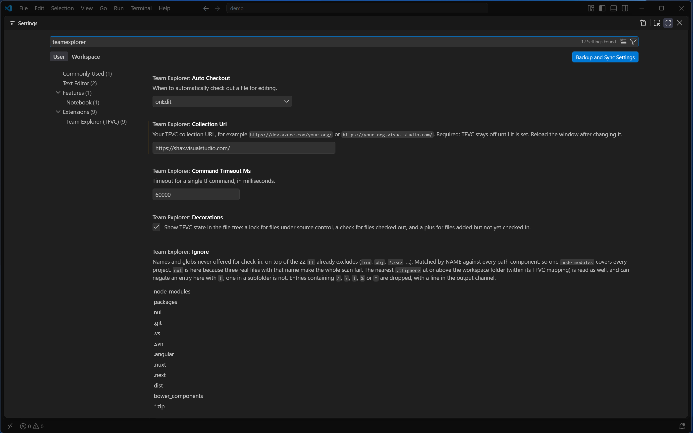
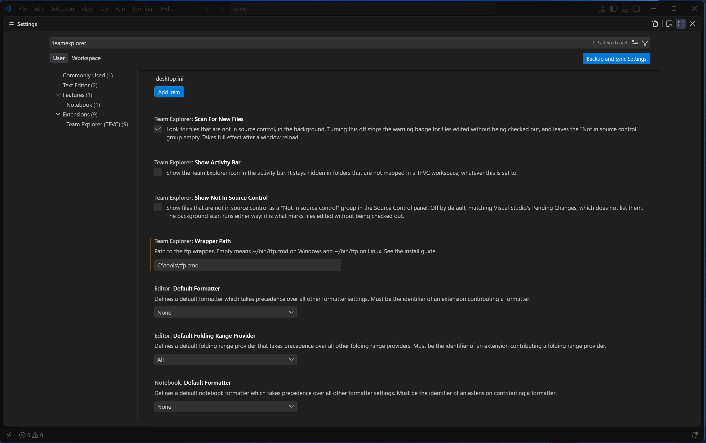

# Settings

All of Team Explorer (TFVC)'s settings live under one heading, **Team Explorer (TFVC)**, in VS
Code's Settings editor (`Ctrl+,`, then search "teamexplorer"):





(The search box also turns up a couple of unrelated editor settings whose descriptions happen to
contain the same letters — scroll past those.)

## Every setting

| Setting | Default | Scope | What it does |
|---|---|---|---|
| `teamExplorer.collectionUrl` | `""` (empty) | — | Your TFVC collection URL, for example `https://dev.azure.com/your-org/` or `https://your-org.visualstudio.com/`. **Required**: TFVC stays off until it is set. Reload the window after changing it. |
| `teamExplorer.wrapperPath` | `""` (empty, meaning `~/bin/tfp.cmd` on Windows and `~/bin/tfp` on Linux) | machine | Path to the `tfp` wrapper. See the [install guide](../install/README.md). |
| `teamExplorer.autoCheckout` | `"onEdit"` (`"onEdit"` \| `"onSave"` \| `"disabled"`) | — | When to automatically check out a file for editing. See [editing-files.md](editing-files.md#auto-checkout). |
| `teamExplorer.commandTimeoutMs` | `60000` (1000-600000) | — | Timeout for a single `tf` command, in milliseconds. |
| `teamExplorer.decorations` | `true` | — | Show TFVC state in the file tree: a lock for files under source control, a check for files checked out, and a plus for files added but not yet checked in. |
| `teamExplorer.ignore` | see below | — | Names and globs never offered for check-in, on top of the 22 `tf` already excludes (`bin`, `obj`, `*.exe`, ...). Matched by name against every path component, so one `node_modules` entry covers every project. `nul` is included because three real files with that name make the whole scan fail. The nearest `.tfignore` at or above the workspace folder (within its TFVC mapping) is read as well, and can negate an entry here with `!`; one in a subfolder is not read. Entries containing `/`, `\`, `!`, `%` or `^` are dropped, with a line in the output channel. |
| `teamExplorer.scanForNewFiles` | `true` | — | Look for files that are not in source control, in the background. Turning this off stops the warning badge for files edited without being checked out, and leaves the "Not in source control" group empty. Takes full effect after a window reload. |
| `teamExplorer.showNotInSourceControl` | `false` | — | Show files that are not in source control as a "Not in source control" group in the Source Control panel. Off by default, matching Visual Studio's Pending Changes, which does not list them. The background scan runs either way: it is what marks files edited without being checked out. |
| `teamExplorer.showActivityBar` | `false` | — | Show the Team Explorer icon in the activity bar. It stays hidden in folders that are not mapped in a TFVC workspace, whatever this is set to. |

The default `teamExplorer.ignore` list is:

```
node_modules, packages, nul, .git, .vs, .svn, .angular, .nuxt, .next, dist,
bower_components, *.zip, *.msi, *.bak, thumbs.db, desktop.ini
```

## Every command

All commands are under the **Team Explorer** category in the Command Palette (`Ctrl+Shift+P`),
except where noted. Several are deliberately hidden from the palette — reachable only from a
specific menu, or, for Check In, only from its own button — because running them out of context
would be confusing, unsafe, or (for check-in) is a hard rule of this extension: see
[Check In](pending-changes.md#the-comment-box-and-check-in).

| Title | Command id | In palette? | Where you'll find it |
|---|---|---|---|
| Check Out for Edit | `teamExplorer.checkout` | Yes | Source Control panel (pending-rename rows), Explorer's Team Explorer submenu, editor menu |
| Undo Pending Changes | `teamExplorer.undo` | Yes | Source Control panel rows, Explorer's Team Explorer submenu |
| Get Latest Version | `teamExplorer.getLatest` | Yes | Explorer's Team Explorer submenu |
| Add to Source Control | `teamExplorer.add` | Yes | Source Control panel ("Not in source control" rows), Explorer's Team Explorer submenu |
| Refresh | `teamExplorer.refresh` | Yes | Source Control panel title bar |
| Compare with Latest Version | `teamExplorer.compareWithLatest` | Yes | Source Control panel rows (and the row's default click action), Explorer's Team Explorer submenu, editor menu |
| Check for Server Changes | `teamExplorer.checkForServerChanges` | No | Editor menu only — the same command as Compare with Latest Version, retitled for a file with no pending change |
| Set Personal Access Token | `teamExplorer.setPat` | Yes, always (not gated on a mapped workspace) | Command Palette only |
| Check In | `teamExplorer.checkInFromButton` | No | Source Control panel title bar (the Check In button) only |
| Exclude from Check-in | `teamExplorer.exclude` | No | Source Control panel rows (Included Changes) |
| Include in Check-in | `teamExplorer.include` | No | Source Control panel rows (Excluded Changes) |
| View History | `teamExplorer.viewHistory` | Yes | Source Control panel rows, Explorer's Team Explorer submenu, editor menu |
| Show Changeset Details | `teamExplorer.showChangeset` | No | One of the two commands Annotate's hover links run |
| Compare Versions | `teamExplorer.compareVersions` | No | The other command Annotate's hover links run |
| Annotate | `teamExplorer.annotate` | Yes | Explorer's Team Explorer submenu (files only), editor menu |
| Hide Annotations | `teamExplorer.hideAnnotations` | Yes, whenever a file is currently annotated | Editor menu, in place of Annotate once a file is annotated |
| Manage Workspace | `teamExplorer.manageWorkspace` | Yes, always (not gated on a mapped workspace) | Command Palette; also linked from the Team Explorer view's welcome content |
| Source Control Explorer | `teamExplorer.openExplorer` | Yes | Source Control panel title bar; also linked from the Team Explorer view's welcome content |
| Show in Source Control Explorer | `teamExplorer.showInExplorer` | Yes | Explorer's Team Explorer submenu, editor menu |
| View Server Version | `teamExplorer.viewVersion` | No | Used internally by Source Control Explorer |
| Map Server Folder to Local Folder | `teamExplorer.mapServerFolder` | No | Used internally by Source Control Explorer |
| Rename | `teamExplorer.renameItem` | No | Used internally by Source Control Explorer ("Rename…") |
| Delete | `teamExplorer.deleteItems` | No | Used internally by Source Control Explorer ("Delete") |
| Shelve… | `teamExplorer.shelve` | Yes | Source Control panel title bar |
| Find Shelvesets | `teamExplorer.findShelvesets` | Yes | Source Control panel title bar (overflow menu) |
| Resolve Conflicts | `teamExplorer.showConflicts` | Yes | Source Control panel title bar (overflow menu) and rows (Conflicts group) |
| Resolve Conflicts (after Unshelve) | `teamExplorer.resolveConflicts` | No | Runs automatically after Get Latest Version or an Unshelve leaves conflicts |

Two commands — **Set Personal Access Token** and **Manage Workspace** — stay in the palette even
before a folder mapped to a TFVC workspace is open, since you may need either one to get to that
point in the first place. Most other palette entries need `teamExplorer:enabled` (a mapped folder
open) to appear; the one further exception is **Hide Annotations**, whose palette entry depends
only on whether a file is currently annotated, not on that context.

There are no keyboard shortcuts bound to any of these commands.

## The badge colours

The six colour ids the Explorer badges use (see [editing-files.md](editing-files.md)), all
customisable through VS Code's `workbench.colorCustomizations` setting:

| Colour id | Used for | Default |
|---|---|---|
| `teamExplorer.versionedForeground` | The lock badge, on a file under source control | `descriptionForeground` |
| `teamExplorer.checkedOutForeground` | The check-mark badge (checked out) and the arrow badge (pending rename) | `charts.orange` |
| `teamExplorer.addedForeground` | The plus badge, on a file added but not yet checked in | `charts.green` |
| `teamExplorer.deletedForeground` | The minus badge, on a file pending deletion | `charts.red` |
| `teamExplorer.hazardForeground` | The warning badge, on a file edited without being checked out | `errorForeground` |
| `teamExplorer.excludedForeground` | Any of the above, dimmed, on a file excluded from the next check-in | `disabledForeground` |

The default for each is the same in light, dark and high-contrast themes — they resolve to
whatever your current theme uses for that base colour.

Back to the [manual contents](README.md).
