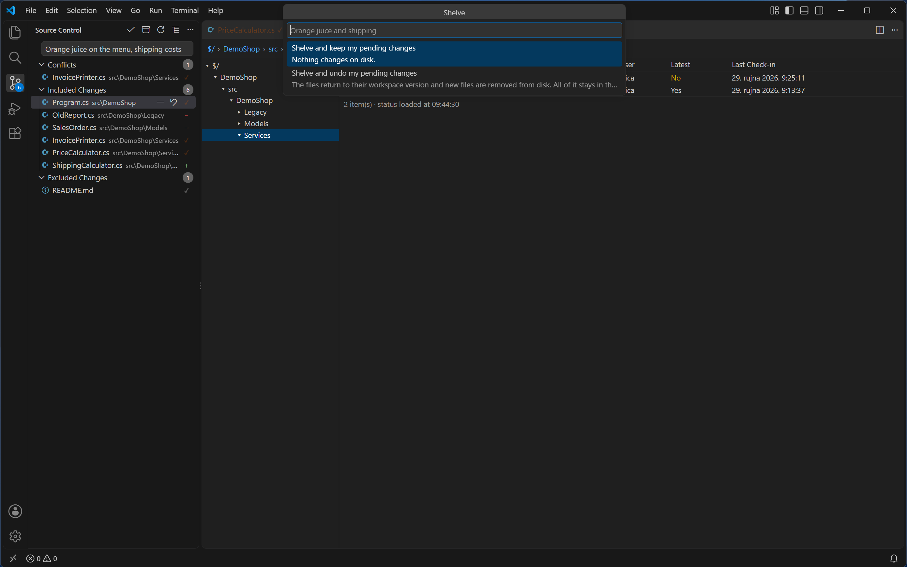
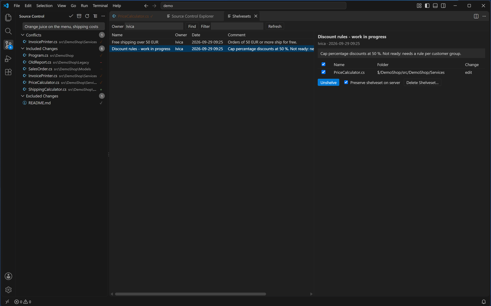
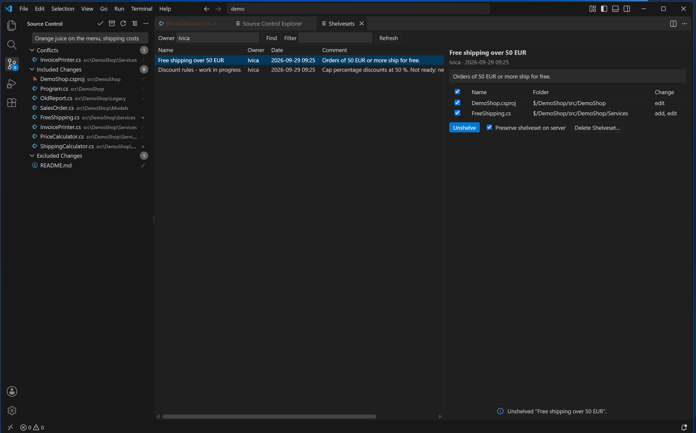

# Shelvesets

[Back to the manual](README.md)

Shelving sets pending changes aside on the server, without checking them in, so you (or someone
else) can bring them back later — on this computer or a different one.

## Shelve

Run **Team Explorer: Shelve…**, or its icon on the Source Control panel's title bar. Shelve takes
exactly what Check In would: the **Included Changes** in the Source Control panel and its comment
box. **Excluded Changes** are left out. If nothing is included, it is refused with "There are no
included changes to shelve."

`tf` shelves each file as it is on disk, so if any included file has unsaved edits, you are asked to
save first — "Save `<names>` before shelving?", detail "tf shelves each file as it is on disk, so
unsaved edits would be left out." A pending delete is never included in that prompt, because saving
it would recreate the very file the delete is meant to remove.

You are then asked for a name (up to 64 characters; cannot start with `-`; cannot contain `" / : < >
\ | * ? ; % ^ !` or a control character), and then for a choice of what happens to your pending
changes locally:

- **Shelve and keep my pending changes** — "Nothing changes on disk."
- **Shelve and undo my pending changes** — "The files return to their workspace version and new
  files are removed from disk. All of it stays in the shelveset."

Only after that, if you already have a shelveset by the name you typed, are you asked to replace it
— "You already have a shelveset named "`<name>`". Replace it?", detail "What it holds now is lost."
— before anything is overwritten.

## Find Shelvesets

Run **Team Explorer: Find Shelvesets**, or **Find Shelvesets** in the Source Control panel's "…"
menu. It opens a tab with an **Owner** box (starting on you), a **Find** button to look up that owner's
shelvesets on the server, a **Filter** box that narrows the list already loaded (no server call),
and **Refresh**. The list shows **Name**, **Owner**, **Date**, **Comment**; selecting a shelveset
shows its full comment and its changes as a ticked checklist — **Name**, **Folder**, **Change** —
plus **Unshelve**, a **Preserve shelveset on server** checkbox, and **Delete Shelveset…**.

Right-clicking a change in that checklist offers **Compare with Unmodified**, **Compare with
Workspace Version** and **View Shelved Version**; double-clicking a change runs **Compare with
Unmodified** directly.

## Unshelve

Untick anything you do not want back, then press **Unshelve**. A ticked change that is not mapped
in this workspace is refused by name — untick it to unshelve the rest. Files about to be
overwritten are, as with Shelve, saved first if they have unsaved edits.

**Preserve shelveset on server**, ticked, keeps the shelveset afterward no matter what. Leaving it
unticked is where a **partial unshelve** matters: if this is your own shelveset and you left at
least one change unticked, Team Explorer asks *before* running anything — "Unshelve `<n>` of `<m>`
changes from "`<name>`", and delete "`<name>`" from the server?", with the unticked changes named and
a warning that they exist only in the shelveset and deleting it loses them for good. The two choices
are **Unshelve and Keep** (switches Preserve on, so the shelveset stays) and **Unshelve and Delete**
(goes ahead and, once the unshelve and every other check below pass, deletes the shelveset even
though not everything in it was unshelved). This confirmation never appears when Preserve is
ticked, the shelveset is not your own, or every change is ticked.

Once the unshelve runs, Team Explorer looks for conflicts among what was just unshelved. If it finds
any, the [Resolve Conflicts](conflicts.md) tab opens on its own and you are told how many need
resolving.

**The shelveset is deleted from the server afterward only when every one of the following is true:**
Preserve was not ticked; it is your own shelveset; the unshelve itself finished without error;
whether it left conflicts could actually be checked, and it left none; every change you asked to
unshelve actually arrived as a pending change in your workspace; and — checked one more time, right
before deleting — the shelveset on the server still lists the same set of files it did when this tab
loaded it (this compares which files are in it, not their contents, so replacing the shelveset with
a same-named one touching the same files in between would still pass), and, unless you chose
**Unshelve and Delete** above, that set is exactly what you unshelved. If any of that is not so, the
shelveset stays on the server and you are told why — for example that it belongs to someone else,
that the unshelve left conflicts, that not every change in it was unshelved, or that it changed on
the server since this tab opened it.

## Delete

**Delete Shelveset…**, on the Find Shelvesets tab, works only on your own shelvesets and asks to
confirm first — "Delete shelveset "`<name>`"?", detail "A deleted shelveset cannot be restored."
