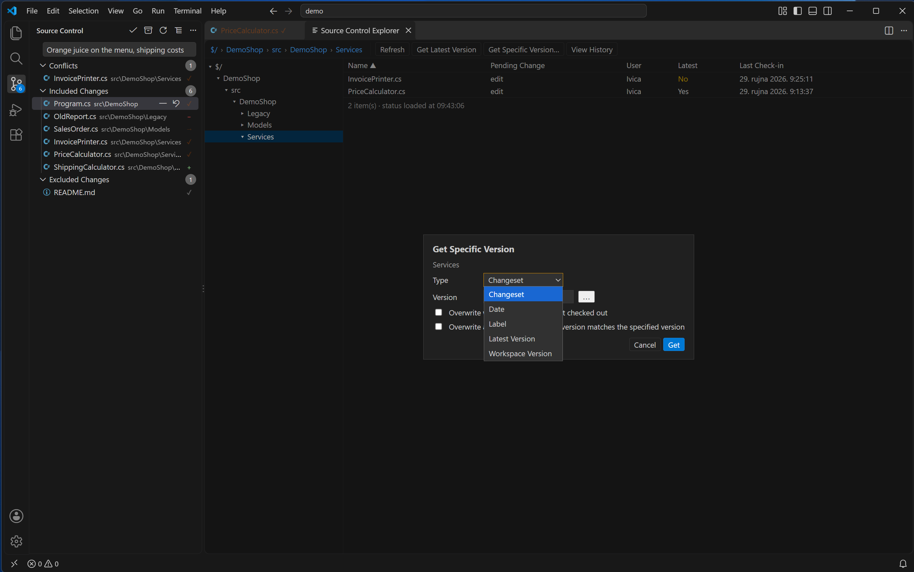
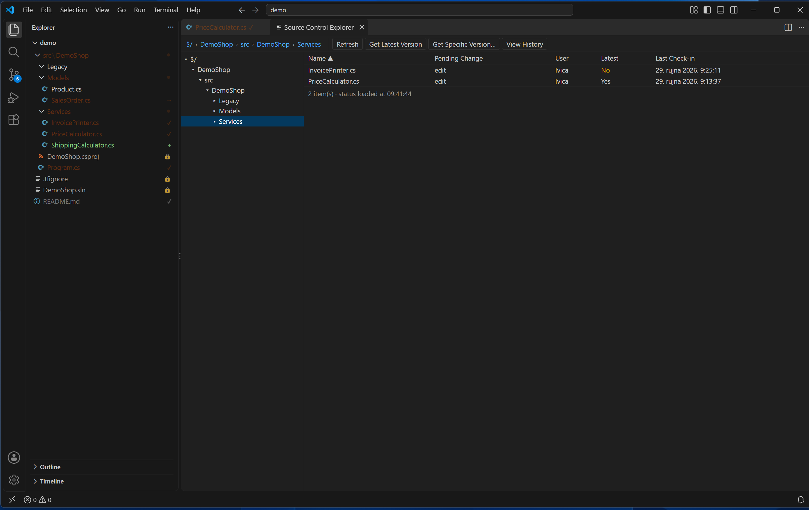

# Source Control Explorer

[Back to the manual](README.md)

Source Control Explorer is a full browser of the server's TFVC tree — not just what you have
mapped locally. Open it with the command **Team Explorer: Source Control Explorer**, the icon on
the Source Control panel's title bar, or by right-clicking a file or folder and choosing **Show in
Source Control Explorer**, which opens the explorer with that item selected. It opens as one tab;
asking for it again reveals the existing tab rather than opening a second one.

## The two panes

The left pane is a folder tree starting at `$/`. Expanding a folder loads its subfolders from the
server the first time it is opened, and keeps them once loaded.

The right pane lists the contents of whichever folder is open — folders first, then files — with
five columns: **Name**, **Pending Change**, **User**, **Latest**, **Last Check-in**. Click a column
header to sort by it; click again to reverse the order. Names appear first; the other columns fill
in as their information arrives from the server, so a large folder is usable before everything has
loaded. The footer shows the item count and when status was last loaded.

**This list is server items only.** It is built from what the server's own directory listing
returns, not from your local pending changes. A pending Add you have not checked in yet is not
listed here at all, because the server does not have it yet — it appears once you check it in.
**Pending Change** shows *your own* pending change on an item that the server already has (for
example `edit`), and **Latest** tells you whether your local copy matches the server's latest
version (`Yes`/`No`), or whether it has never been downloaded or is not mapped in this workspace.

## The toolbar

Across the top: **Refresh**, **Get Latest Version**, **Get Specific Version…**, **View History**.
**These always act on the open folder itself**, whatever is selected (or not selected) in the list
below — to act on a particular file or subfolder instead, right-click it.

Right-clicking an item offers more, depending on what is selected: **View**, **Check Out for
Edit**, **Undo Pending Changes…**, **Compare with Latest**, **Annotate**, **Add Items to Folder…**,
**Rename…**, **Delete**, **Map to Local Folder…**, **Copy Server Path**, alongside its own **Get
Latest Version**, **Get Specific Version…** and **View History** (which, from this menu, act on the
selection rather than the open folder). Menu entries that do not apply to the current selection are
dimmed rather than removed, the same as History's row buttons.

### Get Specific Version

**Get Specific Version…** opens a small dialog with a **Type** dropdown and a **Version** field:

- **Changeset** — a changeset number (for example `16730`); the **…** button next to the field
  picks from the item's recent changesets.
- **Date** — a date as `YYYY-MM-DD` (for example `2026-09-01`), read as of midnight that day.
- **Label** — a label name (up to 64 characters, no leading `-` and none of `" / \ : < > | * ? ; @ !
  % ^`).
- **Latest Version** and **Workspace Version** — no value needed.

Two checkboxes, off by default, can overwrite work, so ticking either one adds one further modal
confirmation before anything runs: **Overwrite writable files that are not checked out** (files with
edits this extension cannot see are replaced by the server version) and **Overwrite all files even
if the local version matches the specified version** (every file is downloaded again, even ones
already at that version). Ticking both still asks only the one confirmation, its detail explaining
whichever box or boxes are ticked. **Get** runs it; **Cancel** closes the dialog without doing
anything.

### View, Map to Local Folder, Rename and Delete

**View** opens a read-only copy of the server's latest version of a file; it works on files only.

**Map to Local Folder…** is offered only on an item that is not mapped anywhere in this workspace
yet — it starts the same mapping flow as Manage Workspace's Add Mapping, already pointed at this
server path. If the item is already mapped, it is refused: change an existing mapping from [Manage
Workspace](workspaces.md) instead, which also warns you about the effect of moving one.

**Rename…** and **Delete** do the same rename and delete that the VS Code Explorer does — see
[Editing files](editing-files.md) for what that pends and how failures are handled. Rename needs the
item downloaded locally first; Delete does not.

