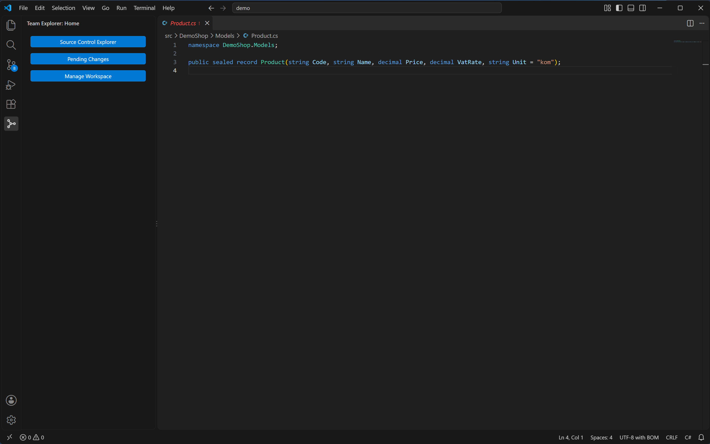
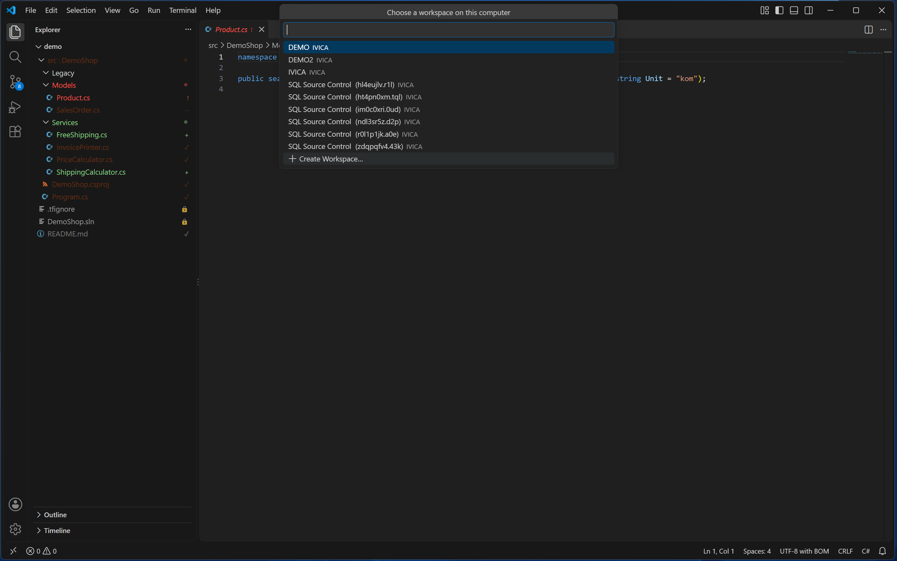
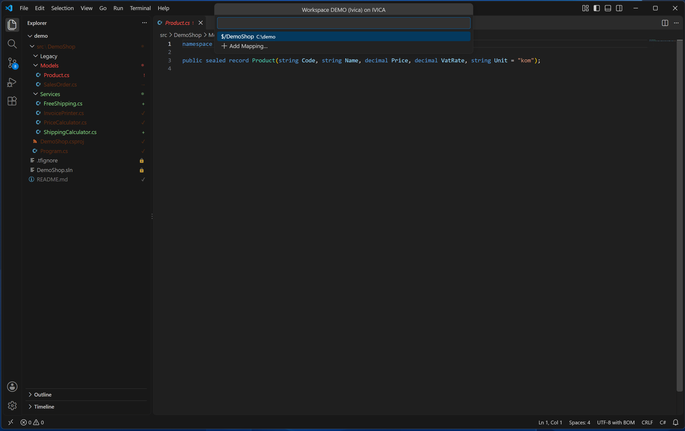

# Workspaces

[Back to the manual](README.md)

A TFVC workspace maps server folders (`$/...`) to local folders on one computer. When this
extension creates a new workspace, it is always a **server workspace** — the kind where the server
keeps the list of pending changes. If Visual Studio is set up on the same computer and using the
same workspace, it sees every mapping this extension makes there.

Open workspace management with the command **Team Explorer: Manage Workspace**.

## Manage Workspace

What you see depends on how many workspaces this computer already has in the collection:

- **None yet** — a picker titled "This computer has no workspace in the collection yet.", with one
  entry, **Create Workspace…**.
- **Exactly one** — Manage Workspace skips straight to that workspace's own list of mappings (no
  extra picker), titled "Workspace `<name>` on `<computer>`" (or "Workspace `<name>` (`<owner>`) on
  `<computer>`" when the owner is known). Each mapping is a row; **Add Mapping…** and **Create
  Workspace…** are appended as the list's last two rows.
- **Two or more** — a picker titled "Choose a workspace on this computer" lists every workspace (its
  name and computer) plus **Create Workspace…** as the last row. Picking a workspace opens its own
  mapping list, the same as above, except **Create Workspace…** is not repeated there (you already
  had the chance in the picker).

Selecting a mapping row offers **Get…** or **Remove Mapping**.

## Creating a workspace

**Create Workspace…** asks for a name (defaulting to this computer's name). A name cannot be empty,
cannot be longer than 64 characters, cannot start with `-`, cannot contain any of `; / \ : * ? " < >
|` or `! % ^`, and cannot repeat the name of a workspace this computer already has (checked
case-insensitively, and refused with "This computer already has a workspace named `<name>`."). After
confirming "Create server workspace `<name>`?", the workspace is created and you are walked straight
into adding its first mapping — nothing is downloaded until you choose a folder and what to get
from it.

## Mapping and unmapping

Adding a mapping asks you to browse the server tree from `$/` down (or, from the Source Control
Explorer's **Map to Local Folder…**, the server path is already chosen for you) and then pick a
local folder, before confirming.

A few situations are refused outright rather than offered as a choice. The local folder cannot
already be the local half of a mapping, and cannot sit inside one either — checked against every
workspace on this computer, not just the one you are editing. Going the other way, a local folder
that would contain an existing mapping (in this workspace) is refused too, *unless* that inner
mapping already sits at exactly the matching nested server path beneath the one you are adding — a
deliberate, consistent child mapping nested inside a broader one is allowed. Separately, picking
exactly the mapping that already exists, or one already covered by a broader mapping, changes
nothing and is just reported back.

### Moving an existing mapping

If the server folder you are mapping is *already* mapped elsewhere in the same workspace, Manage
Workspace's own Add Mapping is the one place that offers to move it, confirming "`<server path>` is
mapped to `<old local folder>`. Move it to `<new local folder>`?" The Source Control Explorer's own
**Map to Local Folder…** never offers this move; it refuses and tells you to use Manage Workspace
instead.

**A move does not touch anything on disk by itself.** What it changes is the mapping: the files stay
exactly where they are until you run Get again. **The next Get of that server folder then moves its
files from the old local folder to the new one** — and because Visual Studio, on the same computer,
shares this same workspace, it will only find those files at the new location afterward. The same
warning applies in reverse when you remove a mapping that a broader mapping in the workspace already
covers: the files stay on disk, but the next Get of that broader mapping moves them back under it.

Once a mapping is added (or moved), Team Explorer offers to Get right away. A folder with no
subfolders of its own gets a plain yes/no confirmation; a folder with subfolders gets a checklist —
"Everything under `<server path>`" plus each immediate subfolder, nothing ticked by default. Escape,
or ticking nothing, gets nothing; you can always run Get later instead.

## The activity bar icon

The setting `teamExplorer.showActivityBar` (boolean, default `false`) controls a Team Explorer icon
in VS Code's activity bar: "Show the Team Explorer icon in the activity bar. It stays hidden in
folders that are not mapped in a TFVC workspace, whatever this is set to." With the setting on and
the open folder mapped, clicking the icon opens a "Team Explorer: Home" panel with three buttons:
**Source Control Explorer**, **Pending Changes**, **Manage Workspace**.

